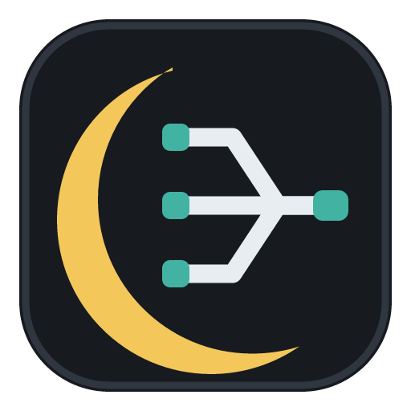

  
  <h1>Luna Mux</h1>
  
A terminal workspace built for coding agents

  

    
    
    
  

  

    <a href="docs/DEVELOPMENT.md">Development guide</a>
    ·
    <a href="docs/LUNA_MUX_DESIGN.md">Design</a>
  

English · <a href="README.md">简体中文</a>

Luna Mux is a terminal workspace built for coding agents. It maintains a Session per project directory; each Session holds multiple terminal panes, and each pane can be a local terminal or an SSH remote terminal. When you launch Codex, Claude Code, or another agent in a terminal, Luna Mux automatically injects a Hook and MCP servers to extend it: the Hook monitors status, the Luna Mux MCP lets the agent control Luna Mux itself, and the agent-browser MCP lets it drive the browser. It also ships the complete SSH and SFTP capabilities ported from Luna Remote.

## Project Sessions and Terminal Panes

A Session corresponds to one project directory and persists its project root and pane layout.

- A Session holds multiple terminal panes with horizontal and vertical splits, draggable ratios, presets, rename, and maximize.
- Each pane can be a local terminal (macOS zsh/bash, Windows PowerShell or WSL) or an SSH remote terminal.
- Local and remote terminals share one xterm.js UI, including search, clipboard handling, themes, fonts, backgrounds, and output flow control.
- Restarting the app restores Sessions and layouts without reconnecting hosts or restarting processes behind the user's back.

## Agents in the Terminal

Launch `codex` or `claude` in any pane and Luna Mux detects the agent and injects a Hook and MCP servers to extend it.

### Status Monitoring (Hook)

- The Hook reports working, waiting-for-input, waiting-for-permission, completed, and error states back to Luna Mux.
- Panes that need attention are flagged in the sidebar, the pane border, and desktop notifications that route back to the owning Session and Pane.
- The Agent Environment view shows health state for the Adapter, Hook, Luna MCP, and Browser MCP.
- Agent lifetime follows the app; managed terminals, agents, and Chrome close with Luna Mux.

### Controlling Luna Mux (Luna Mux MCP)

- The Luna Mux MCP exposes Sessions, Panes, terminals, agents, connections, settings, diagnostics, transfers, and tunnels to agents.
- Agents can discover Sessions, Panes, Terminal Runtimes, and other managed agents.
- Agents can create Panes, update layouts, read bounded terminal output, and write terminal input.
- Agents can inspect agent state, send tasks, and interrupt managed agents.
- Agents can read safe connection summaries, update themes and terminal appearance, and run built-in diagnostics.
- Closing Runtimes or starting transfers and tunnels requires desktop confirmation first.
- Credentials, private keys, and API keys are never exposed to agents through MCP.

### Browser Automation (agent-browser MCP)

Agents drive the browser on their own to complete web tasks: opening pages, clicking, filling forms, taking snapshots, capturing screenshots, and inspecting the console and network. They operate a Session-scoped, isolated Chrome through the [`agent-browser`](https://github.com/vercel-labs/agent-browser) MCP, which runs as a standalone window you can take over at any time.

- Snapshots, interaction, waits, tabs, screenshots, console inspection, network requests, and HAR capture are supported.
- Chrome starts lazily on first use, then the same Runtime and page are reused.
- Remote SSH agents reach the desktop's Chrome through an authenticated proxy; raw CDP is not exposed to the remote host.

## SSH and SFTP

The complete SSH and SFTP capabilities are ported from Luna Remote.

- SSH supports passwords, private keys, SSH Agent, host-key verification, keepalive, and one jump host.
- Connections can be grouped, reordered, backed up, and imported from OpenSSH Config or a Luna Remote database.
- SFTP supports local/remote browsing, upload, download, preview, drag and drop, queues, and retry.
- Local, remote, and SOCKS5 dynamic forwarding are supported.

## AI Command Assistant

The AI command assistant is independent of Codex and Claude agents. It uses a user-configured OpenAI-compatible service to generate Linux Shell, PowerShell, CMD, or macOS commands for the focused local or SSH terminal.

- Suggestions include explanations, assumptions, warnings, and a risk level, and can be copied, inserted without Enter, or executed after risk confirmation.
- Optional terminal context is processed by common personal-data redaction before the request is sent.
- Leaving AI unconfigured does not affect any other feature.

## Development

Environment setup, checks, and packaging instructions are in the [development guide](docs/DEVELOPMENT.md).

## License

Luna Mux is released under the [MIT License](LICENSE). Third-party components, fonts, and bundled tools retain their own licenses and distribution terms.
